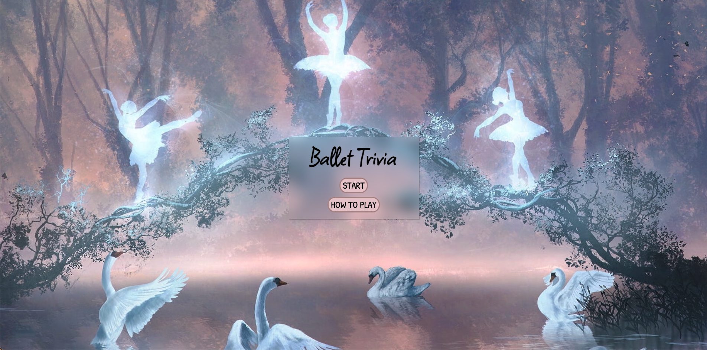
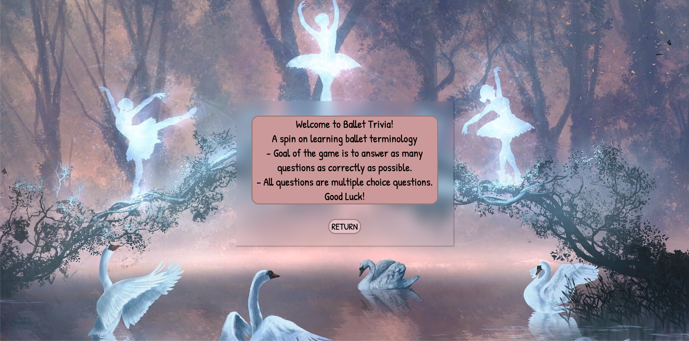
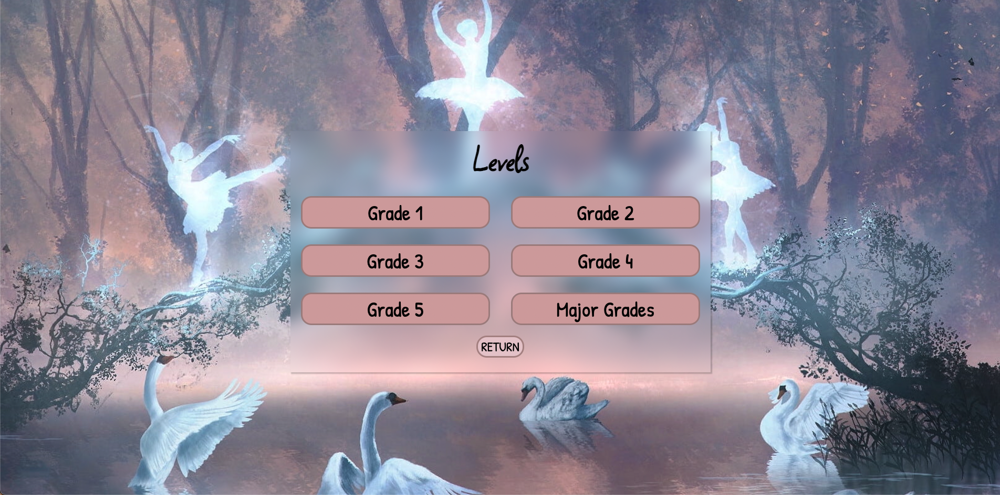
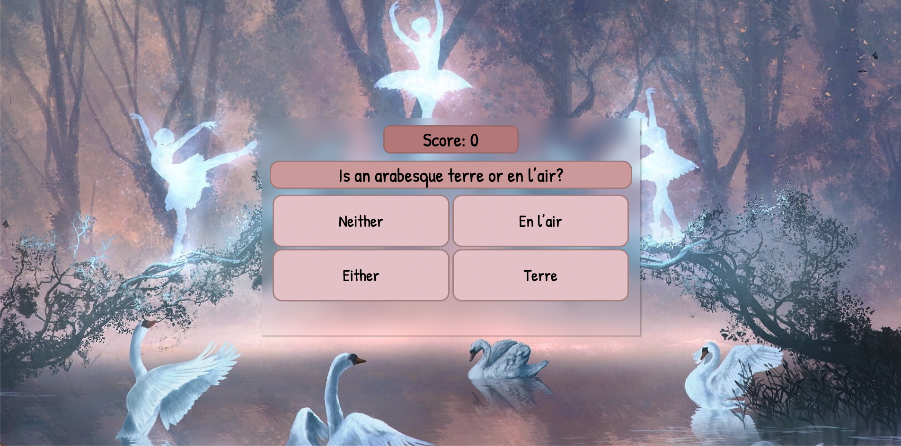
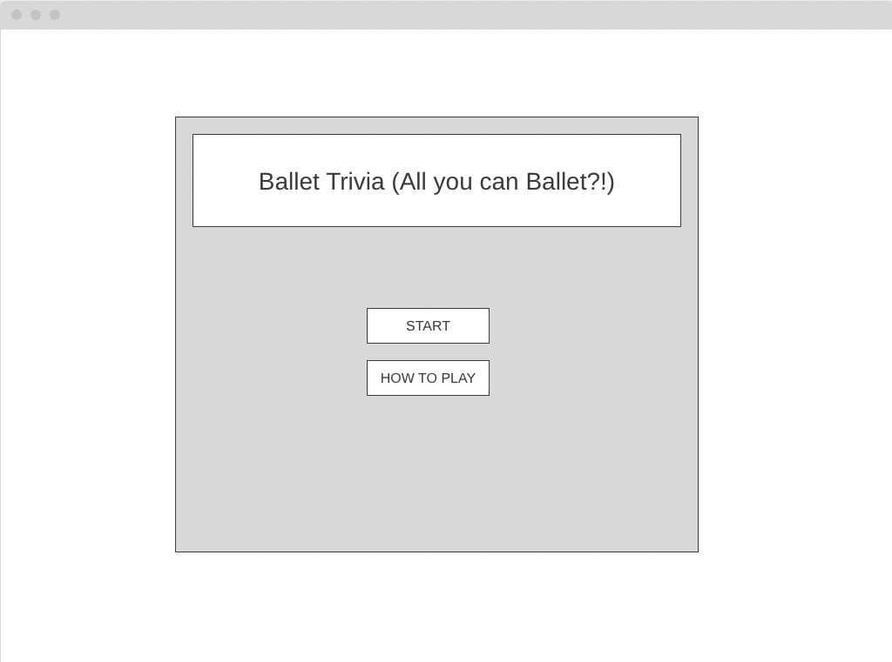
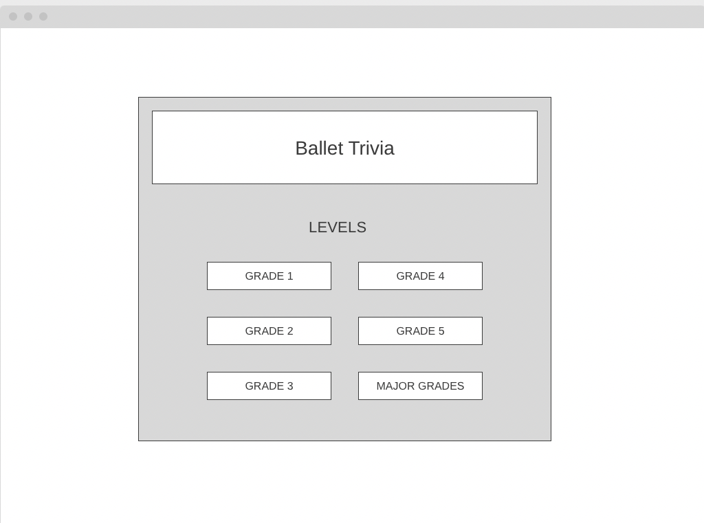
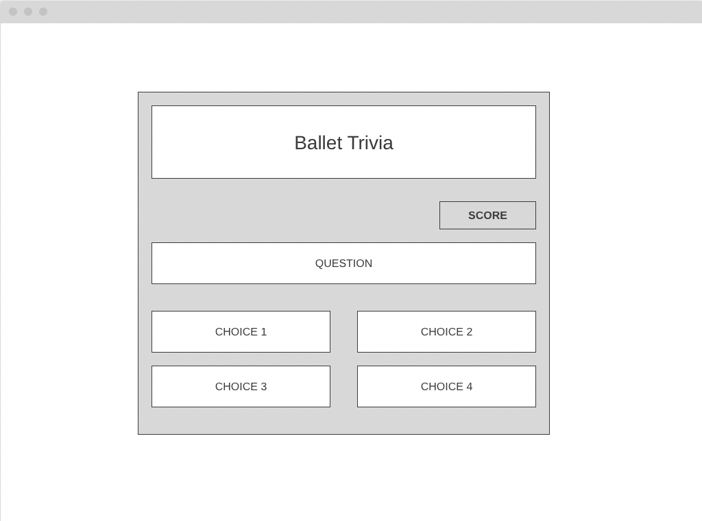
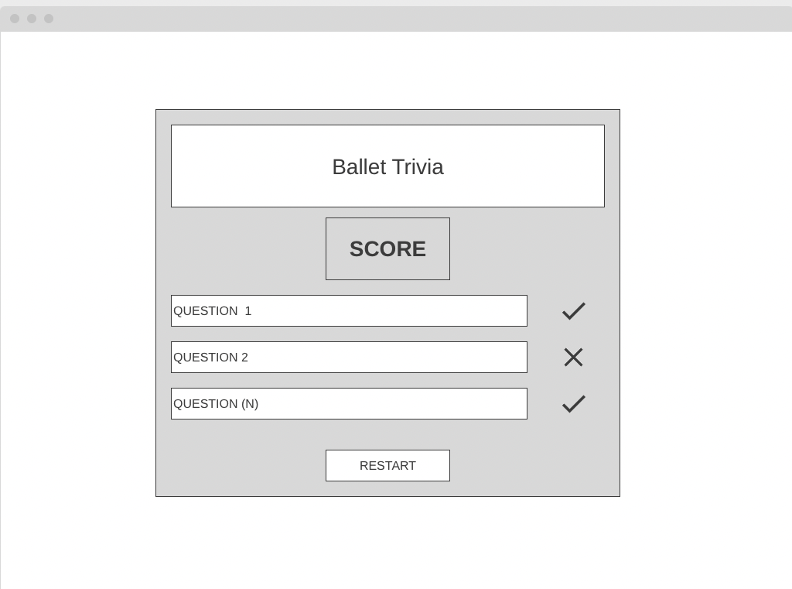

# Ballet-Trivia
## Project Description 

<link to the game>

Ballet Trivia is a game for players(dancers) who wants to test their ballet terminology. Ballet terminology is an important aspect of exams that most dancers have to take, thus a more fun way to learn would be through a game! It is a single-player game that consists of questions of different levels of difficulty, and the goal is to try to score the highest as possible. Players will have the choice to restart the game as many times as they desire after each round, and the questions will be given in a randomized order every round.
## How to Play 

A spin on learning ballet terminology. Goal of the game is to answer as many questions as correctly as possible. All questions are multiple choice questions.
## Project Images 

Main View

How to Play View

Level Select View

Questions View

Final Results Display View [INSERT IMAGE]

Score History View [INSERT IMAGE]
## Technologies Used 

- HTML 
- CSS
- JavaScript 

## Problems
A problem I came across is when a user clicks on a levels button, it takes them directly to the questions view without a delay. If a user accidently double clicks instead of doing a signle click, they'll accidently answer the first question due to the timing of the transition from levels view to question display view. I would like to fix out this UI issue at a later time. 

## User Stories 

### MVP Goals
- As a player, I would like to see a ‘start’ and ‘how to play options when the page is opened.
- As a player, I would like to choose the level of difficulty.
- As a player, I would like to see multiple-choice questions.
- As a player, when I choose my answer I would like to see it being highlighted.
- As a player, I would like to see an indication of the score while I’m playing.
- As a player, I would like to see correct and incorrect questions at the end of each round.
- As a player, I would like to restart at the end of the game.
- As a player, I want the UI to be minimalistic and easy to navigate.

### Stretch goals

- As a player, I would like to see the history of my score up to five games.
- As a player, I would like to hear an audible sound when I get all questions correct.
- As a player, I would like a timer to race against.
- As a player, I would only like to be able to move on the difficult levels once I have gotten a perfect score in the previous levels.
- As a player, I would like to also see a general knowledge section about Ballet.

## Wireframes

View 1 

View 2

View 3

View 4

## Resources
https://developer.mozilla.org/en-US/

https://www.w3schools.com/

https://stackoverflow.com/

https://wireframe.cc/